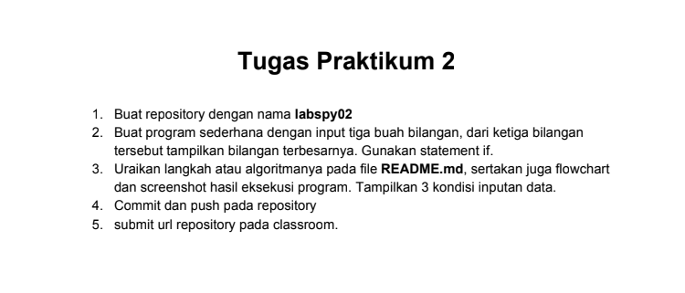
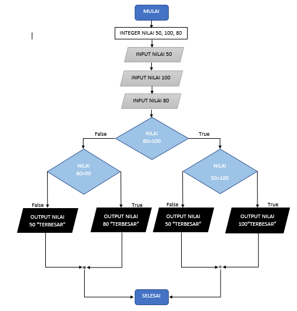
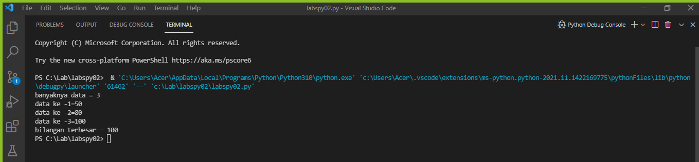

# labspy02
# **Struktur Kondisi**

```sh
Nama    : Aef Saefuddin
Nim     : 312110521
Matkul  : Pemrograman
```

## **Tugas**
## Soal


## **Jawab**
langkah pertama membuat inputan nilai terlebih dahulu

```sh
a = int(input("Masukkan bilangan 1: "))
b = int(input("Masukkan bilangan 2: "))
c = int(input("Masukkan bilangan 3: "))
```
Lalu Masukan Angka Yang Di Inginkan

Saya Memasukan Angka 50, 100, 80

## **Flowchart**

Di bawah Ini Saya Membuat Flowchart


## **Syntax**
```sh
N=int(input("banyaknya data = "))
if N>0:
    i=1
    x=int(input("data ke -"+str(i)+"="))
    max=x;total=x
    for i in range(2,N+1):
        x=int (input("data ke -"+str(i)+"="))
        total+=x
        if max<x:
            max=x

    print("bilangan terbesar =",max)
```

## **Output**
Di Bawah Ini adalah Hasil Ouputnya.
